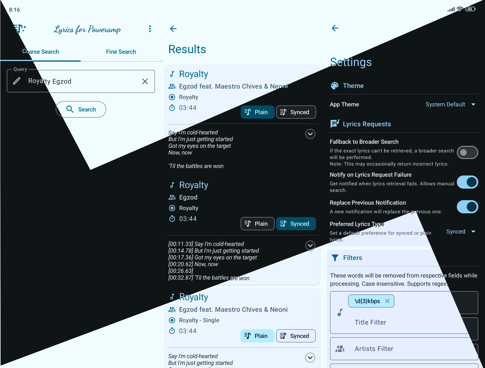

 

A lyrics plugin for <a href="https://powerampapp.com/">Poweramp</a> 
 

 

### :package: Download

| GitHub                                                                                                                                                                            | Play Store                                                                                                                                                                                                                                                            |
|-----------------------------------------------------------------------------------------------------------------------------------------------------------------------------------|-----------------------------------------------------------------------------------------------------------------------------------------------------------------------------------------------------------------------------------------------------------------------|
|                             |  |
|  |               |
| [Goto Latest Release](https://github.com/abhishekabhi789/LyricsForPowerAmp/releases)                                                                                              | [View on Play Store](https://play.google.com/store/apps/details?id=io.github.abhishekabhi789.lyricsforpoweramp&referrer=utm_source%3Dgithub%26utm_medium%3Dreadme%26utm_campaign%3Ddownload_table)                                                                    |

> [!NOTE]  
> The Google Play version contains extra features, including a free library UI that allows you to browse and manage lyrics collection seamlessly. Premium features include a batch downloader for fetching multiple lyrics at once, saving time and effort for users with extensive music libraries.

> [!IMPORTANT]
> Play Store builds are signed by Google hence you can't update GitHub Variant from Play Store.

### :flower_playing_cards: Screenshots

### :shield: Permissions

- **Internet**: Required for fetching lyrics from LRCLib.
- **Notification**: Displays status of lyrics requests.
- **Storage**: To Store lyrics in Files.

### :wrench: Setup and Usage

See [Usage Instructions](docs/guide.md)

### :lock_with_ink_pen: Privacy Policy

Read the Privacy Policy [Here](docs/privacy-policy.md)

### :books: References

1. [Poweramp API](https://github.com/maxmpz/powerampapi)
2. [LRCLib](https://lrclib.net/) - Lyrics Source

### :gift_heart: Support

### :running: Check Out Other Projects

Visit [Website](https://abhishekabhi789.github.io/)
